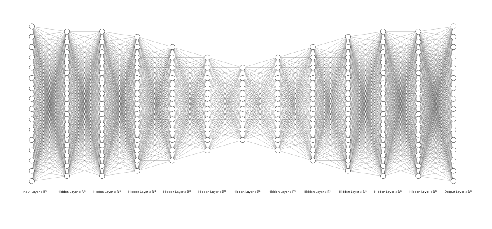
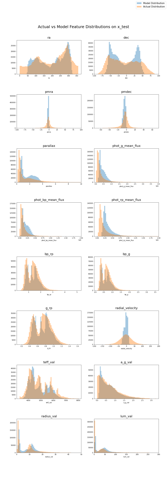
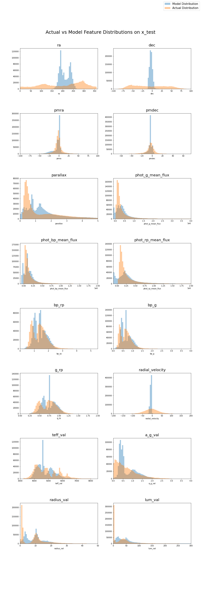

# Approaches to a Variational Autoencoder for Gaia DR2 data
## Why?
Implementing a reliable VAE that could compress and accurately reconstruct astrophysical data sets, such as Gaia, could provide a number of benefits. Firstly, it would allow researchers to conduct representative data sampling from the latent space of a compressed data set before one is ready to release the entire data set. Additionally, it could obviously allow for reliable compression to send/recieve large chunks of the data set, which as raw data can run into the **terrabytes**.
## Process
I began by selecting a condensed list of 25 features to query from Gaia (along with cuts to remove null data), and when first getting started I even omitted the 9 error fields, leaving only 16 training features. The plan was to design an autoencoder that reliably compressed and reconstructed these features, and then modify it to work on objects with values for **all** fields offered by Gaia.
```SQL
SELECT
ra,                ra_error,
dec,               dec_error,
pmra,              pmra_error,
pmdec,             pmdec_error,
parallax,          parallax_error,
phot_g_mean_flux,  phot_g_mean_flux_error,
phot_bp_mean_flux, phot_bp_mean_flux_error,
phot_rp_mean_flux, phot_rp_mean_flux_error,
bp_rp,
bp_g,
g_rp,
radial_velocity,   radial_velocity_error,
teff_val,
a_g_val,
radius_val,
lum_val
```
I began by implementing a rudimentary autoencoder in Keras, and after tweaking the network's structure and training parameters I managed to get reasonable (but far from perfect) reconstruction. The structure that seemed to work best was anything similar to a nodes-per-layer structure of: 16-15-15-14-12-10-8-10-12-14-15-15-16. Below is the network visualization and the resulting feature distribution, after training with a step-decaying learning rate and a Binary X-Entropy loss.


Clearly, the network is finding useful relationships between features but needs further modification to be accurate. Around this time I attempted to switch to Pytorch, to get more control over how I trained the network. This was a much more convoluted transition than expected, and after building the identical structure and training setup in Pytorch, my feature distributions fell apart and looked nothing like their Keras counterparts. The best I was able to get from Pytorch was this:

The likely culprit is a mistake I've made in the transition to Pytorch, since the network does not seem to converge. However, while investigating this, I ran out of time in the semester before I was able to get the Pytorch version to even match the Keras one. The promising similarity between the shapes of the actual and reconstructed distributions in the Keras version definitely merit further research.
## Various things that I tried
As in an NN design, I played with various structures but found that stacking multiple layers of similar size (eg. 16-16-16-15-15-15-14-14-14...) either did not affect or actually hurt my results. Conversely, compressing too fast (eg. 16-10-8-...) also hurt results. The best-performing structures compressed features slowly but steadily, with only one instance of stacking either at the 15 or 14 node layer.  

During training, a step decay learning rate consistently performed the best when compared to exponential decay or constant rate.  

The loss function was a much more confusing problem. I designed various iterations of a custom loss function, for example one that combined some calculations I wrote myself to focus on certain features along with MSE and KL-Divergence. In the end, KL-Divergence never seemed to work at all, and I am still unsure as to why. MSE and Binary X-Entropy worked best. 
## Conclusion + Next Steps
From the initial progress made on the Keras version, it is clear that there is very likely a correct network design and training implementation that could reliably compress and reconstruct Gaia data, atleast in the domain of these 16 features. Further work in either Keras or Pytorch could yield a good and reliable solution. If and when such a solution is designed, this autoencoder can be properly converted into a **variational** autoencoder to check latent space distributions and to allow the sampling of "fake" data points representative of the actual data set.
